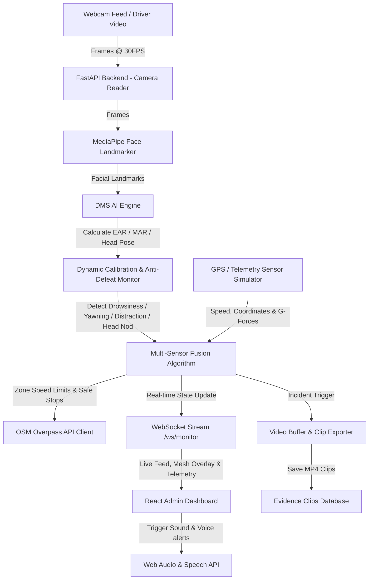

# 🛡️ SentinelDrive — Advanced AI Fleet Safety DMS & Command Center

SentinelDrive is a high-performance, real-time **Driver Monitoring System (DMS)** and **Fleet Safety Command Center**. By combining computer vision (webcam-based face landmark analysis) with multi-sensor telemetry fusion (simulated GPS coordinates, speed, and G-forces), SentinelDrive detects driver fatigue, yawns, head tilts/nods, and distracted behavior. It logs incidents in real-time, manages driver safety ratings, automatically exports evidence video clips, and suggests safe stopping stops nearby using OpenStreetMap integration.

---

## 🚀 System Architecture & Data Flow

Below is the real-time processing pipeline and data flow of the SentinelDrive platform:



---
## 🛠️ Tech Stack

### Frontend
- React
- JavaScript / JSX
- Tailwind CSS
- Vite

### Backend
- Python
- FastAPI
- WebSockets

### Computer Vision
- OpenCV
- Google MediaPipe Face Landmarker

### APIs & Location
- OpenStreetMap
- Overpass API

### Development Tools
- Git
- GitHub
- npm
- Uvicorn

## ✨ Core Features

### 1. Driver Monitoring System (DMS) via Webcam
*   **Real-time Facial Landmarks**: Uses Google MediaPipe Face Landmarker task to track key points on the driver's face at 30 FPS.
*   **Eye Aspect Ratio (EAR) Analysis**: Evaluates eye aperture to detect micro-sleeps or prolonged eye closure (triggers Drowsiness warnings when eyes remain closed for $\ge 0.5$ seconds / 15 frames).
*   **Mouth Aspect Ratio (MAR) Analysis**: Evaluates mouth aperture to track yawning events (warning horn triggers on first yawn; score deductions start if yawning persists).
*   **Head Pose Tracking (NOD/TILT/DISTRACTION)**: Calculates pitch and roll from 3D landmarker vectors to detect head slouching (nodding) or looking away (distraction).

### 2. Adaptive Calibration & Eyewear Anti-Defeat
*   **Dynamic Calibration**: Automatically calibrates baseline stats (open eyes, closed mouth, neutral head position) over the first 60 valid frames after starting the engine.
*   **Sunglasses/Goggles Detection**: Monitors eye-blink variance. If the standard deviation of the EAR drops below `0.008` for 5 seconds while eyes seem "open," the system flags eye tracking as compromised, alerts the dispatcher, and switches verification entirely to head posture and yawning cues.

### 3. Multi-Sensor Fusion & AI Fatigue Scoring
*   **Integrated Score Fusion**: Combines EAR, MAR, head posture, speed variance, and steering zigzag rate into a unified **AI Fatigue Score (0-100)**.
*   **Predictive Estimations**: Factors in time-of-day risks (night shift baseline penalty, post-lunch fatigue windows) and active drive session duration to forecast estimated minutes until critical fatigue onset.

### 4. Dynamic Speed Control & Safety Interventions
*   **Unresponsive Speed Limiter**: If critical drowsiness is active for $\ge 10$ seconds, the backend triggers an emergency speed reduction limit of **60%** (normal speed cap). If the driver remains unresponsive at $\ge 15$ seconds, the vehicle's speed limit is restricted to **30%** (near stop).
*   **Auto Engine Shutoff**: If no face is detected for 11 seconds (330 frames) with the engine active, the backend triggers an automatic engine stop to prevent a runaway vehicle.

### 5. OpenStreetMap Integration (Geo-Safety Zones & Safe Stops)
*   **AI Zone-Based Speed Enforcement**: Translates GPS coordinates into zone limits using OpenStreetMap Overpass API queries. Enforces India Road Safety standards:
    *   *Highway*: 80 km/h
    *   *City Area*: 50 km/h
    *   *Local / Residential Area*: 30 km/h
    *   *Village Area*: 25 km/h
    *   *System Cache*: Implements a grid-based spatial caching filter (~200m cells) with 120s TTL to prevent query spam and API rate-limiting.
*   **Safe Stops Recommender**: Queries OpenStreetMap to locate the nearest bus stops, petrol/gas pumps, rest areas, and convenience amenities within 3km of the driver's coordinates, complete with direct Google Maps route links.

### 6. Interactive Telemetry Simulator & Score Dashboard
*   **Dynamic Deductions**: Every driver begins with a **Safety Score of 100%**. Incident triggers deduct points (-10 points for critical violations, -5 points for warning thresholds) and dynamically compute rating stats.
*   **Telemetry Panel**: Allows operators to inject simulated sensor data (acceleration, braking, lateral G-forces, speed) to test handling limits (Harsh Braking, Harsh Acceleration, Sharp Turn, Overspeeding).
*   **Leaderboard**: Ranks fleet drivers based on real-time safety scores, speed stats, and cumulative incident rates.
*   **Public Passenger View**: Generates a dynamic QR code linked to the public API `/api/passenger/{driver_id}` allowing passengers to scan and check the active driver's safety rating in real-time.

### 7. Circular Evidence Clip Recorder
*   **20-Second Buffering**: Continuously caches the last 20 seconds of video frames at 10 FPS in memory.
*   **Automatic Export**: Upon detection of a critical incident (e.g., drowsiness, excessive yawn, harsh braking), the backend writes buffered frames to disk as a timestamped MP4 clip.
*   **Dashboard Playback**: Serves saved mp4 files directly on the UI for quick fleet auditor checks and downloads.

---

## 📁 Repository Structure

```
SentinelDrive/
├── backend/
│   ├── incident_clips/       # Saved MP4 recordings of critical safety incidents
│   ├── ai_engine.py          # Fuses telemetry, session metadata, and EAR/MAR metrics
│   ├── auth.py               # Admin account setup, token creation, and bcrypt password verification
│   ├── face_landmarker.task  # MediaPipe model binary
│   ├── fatigue_detector.py   # OpenCV frame loop, MediaPipe landmarks, and distraction detectors
│   ├── main.py               # FastAPI routers, WebSocket server state, and main loops
│   ├── rash_driving.py       # Speeding, braking, and sharp-turn threshold processors
│   ├── requirements.txt      # Python backend packages
│   ├── safe_stops.py         # OpenStreetMap Overpass client for locating stops
│   ├── start_backend.bat     # Windows batch script to launch the FastAPI server
│   ├── video_buffer.py       # Circular frame buffer and MP4 exporter logic
│   └── zone_speed.py         # OSM-based zone speed lookup and cache logic
├── frontend/
│   ├── public/               # Static web assets
│   ├── src/
│   │   ├── components/       # Panel widgets (DMS Feed, Telemetry, Safe Stops, Leaderboard)
│   │   ├── hooks/            # useAlarm (WebAudio beep & SpeechSynthesis), useGpsSpeed (GPS locator)
│   │   ├── App.jsx           # Dashboard layout, state controllers, and WebSocket client
│   │   ├── index.css         # Tailwind & custom CSS configurations
│   │   └── main.jsx          # React app entry point
│   ├── package.json          # npm run commands and frontend development packages
│   ├── tailwind.config.js    # Tailwind theme specifications
│   └── vite.config.js        # Vite configurations
└── README.md                 # Platform documentation (this file)
```

---

## 🔐 Security

Before running or deploying SentinelDrive:

- Store credentials in environment variables.
- Never commit `.env` files.
- Never commit production secrets or API keys.
- Use a strong, unique JWT secret.
- Change any credentials that may have previously been exposed.

Example environment configuration:

```env
JWT_SECRET_KEY=your-secure-secret
ADMIN_PASSWORD=your-secure-password
```
---

## 🛠️ Installation & Setup

### Prerequisites
*   **Python 3.9+** (Must be in your environment variables/path)
*   **Node.js 18+** (With npm)
*   **Webcam**: Connected and available to index `0`, `1`, or `2` (the server searches for the first available device).

---

### Backend Setup

1.  Navigate to the backend directory:
    ```bash
    cd backend
    ```
2.  Install Python dependencies:
    ```bash
    pip install -r requirements.txt
    ```
3.  Launch the backend server using the helper batch file or uvicorn directly:
    *   *Using the batch script:*
        ```bash
        .\start_backend.bat
        ```
    *   *Using uvicorn:*
        ```bash
        uvicorn main:app --host 0.0.0.0 --port 8000 --reload
        ```
    The FastAPI API documentation will be available at [http://localhost:8000/docs](http://localhost:8000/docs).

---

### Frontend Setup

1.  Navigate to the frontend directory:
    ```bash
    cd frontend
    ```
2.  Install npm packages:
    ```bash
    npm install
    ```
3.  Run the local development server:
    ```bash
    npm run dev
    ```
4.  Open your browser and navigate to **[http://localhost:5173](http://localhost:5173)** (or the address printed by Vite).

---
